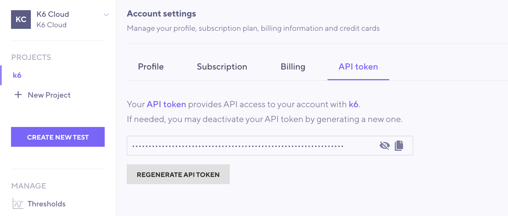
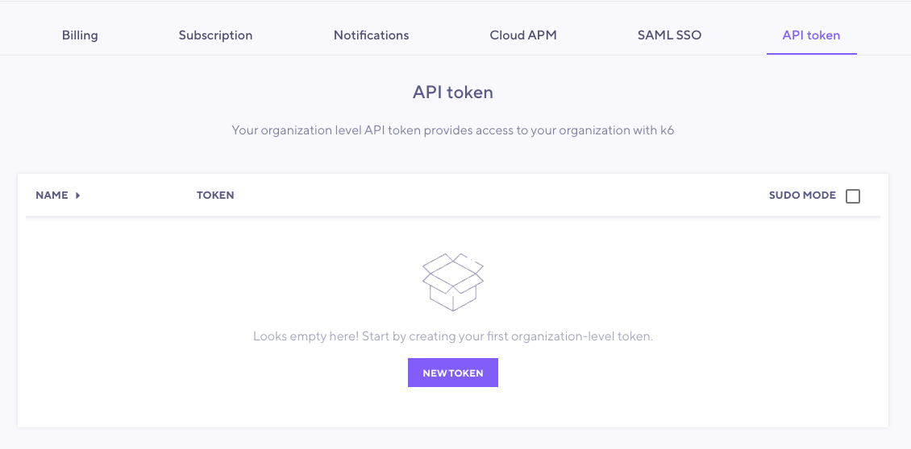

You'll need to authenticate to use k6 Cloud, whether it's for streaming results or running tests in the cloud. Your API token enables the interaction with k6 Cloud using the k6 CLI or through the REST API.

In k6 Cloud there are two ways how you can generate an API Token, via account or organization settings. These tokens differ in the kind of access they provide - [account level API token](#account-api-token) will grant access to your account with k6, while [organization level API token](#organization-api-token) will grant access to your organization.    

Below you'll find instructions on how to generate API tokens and examples on how to utilize them.

> #### Google/GitHub Single Sign-On Users
>
> For Single Sign-On (SSO) users, `k6 login cloud` requires a k6 Cloud account with an email and a password. If you don't want to create a password (using [Forgot Password](https://app.k6.io/account/forgot)), you can authenticate via API token. See [Authenticating with API token](#authenticating-with-api-token) for more information.

> #### Docker Users
>
> If you're running k6 in a Docker container you'll need to make sure that the k6 config file where the k6 Cloud API authentication information is stored to is persisted via a Docker volume to the host machine, using the `-c/--config PATH/TO/CONFIG_FILE` CLI flag. Example:
```bash
docker run --rm -i -v /path/on-host:/path/in-container/ grafana/k6 login cloud -c /path/in-container/config.json
```

> #### Integrating with CI
>
> If you are integrating k6 into your CI pipeline, we recommend using one of the token methods to authenticate and not exposing your username/password within your CI configuration files or as variables.

## Account API token
Account level API token provides API access to your account with k6. To generate the token select **API token** menu item under **Account settings**, where you'll be able to copy, see and regenerate the token.



## Organization API token
Organization level API token provides API access to your organization with k6. To generate a token select **API token** menu item under **Organization settings**, where you'll be able to create, see and regenerate the tokens.
Maximum amount of tokens an organization can create is 5.



> #### Access to organization settings
>
> Only [organization admins](/cloud/project-and-team-management/members/#admin) can access organization settings view.


## Authenticate with email/password

You can forego using a token and use your k6 Cloud email/password credentials by entering the following command into your terminal:

<CodeGroup labels={["Authenticate with email/password"]}>

```bash
k6 login cloud
```

</CodeGroup>

This will login to your account, fetch (and create if necessary) your k6 Cloud API authentication token, and save it to a [k6 configuration file](#using-config-file).

## Authenticating with API token

If you're a Google/GitHub Single Sign-On (SSO) user, or if you have a use case where using your k6 Cloud account credentials is not appropriate, you can choose to enter your k6 Cloud API authentication token directly. You do this by entering the following command into your terminal:

<CodeGroup labels={["Using API token"]}>

```bash
k6 login cloud --token YOUR_API_AUTH_TOKEN
```

</CodeGroup>

## API Token as an environment variable

You can also authenticate with your k6 Cloud API authentication token via environment variables. Make sure the `K6_CLOUD_TOKEN` has been set to your k6 Cloud API authentication token, and k6 will pick it up when executing.

## Authentication with a config file

You can also directly add your k6 Cloud API authentication token to a configuration file:

<CodeGroup labels={["Linux", "MacOS", "Windows"]} lineNumbers={[true, true, true]}>

```bash
${HOME}/.config/loadimpact/k6/config.json
```

```
${HOME}/Library/Application Support/loadimpact/k6/config.json
```

```bash
C:\Users\&lt;User&gt;\AppData\Roaming\loadimpact\k6\config.json
```

</CodeGroup>

or by specifying the `-c/--config PATH/TO/CONFIG_FILE` CLI flag.

When your k6 Cloud API authentication token has been added to the config file, it should look something like this (removing any other config options from the file):

<CodeGroup labels={["API token in JSON"]}>

```json
{
    "collectors": {
        "cloud": {
            "token": "YOUR_API_AUTH_TOKEN"
        }
    }
}
```

</CodeGroup>
